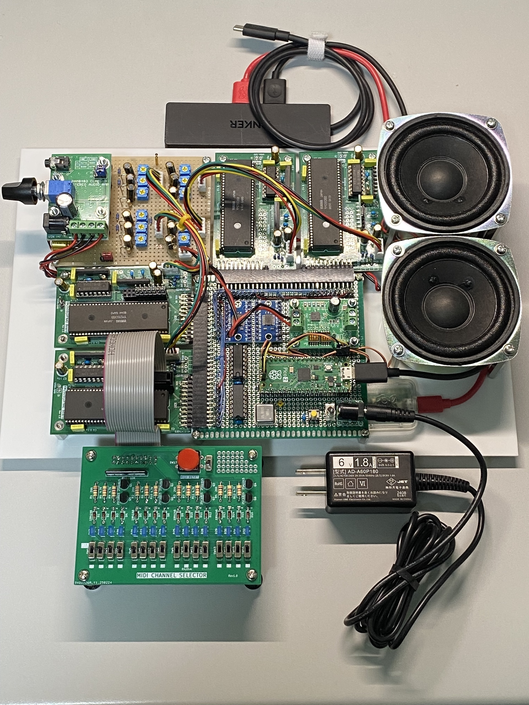

# FMSynthEnsemble

## 特徴

- FM音源シンセサイザ
  - YAMAHAのOPN系FM音源(YM2203/YM2608)を使用
- (ほぼ)GM準拠 USB MIDI音源
  - [MIDIインプリメンテーションチャート](./software/midism/docs/MIDI_ImplementationChart.md)
- CSMモードによる複合正弦波音声合成をサポート

YM2203(OPN), YM2806(OPNA)はモジュール基板となっており、コントローラーモジュールに最大4台まで混在接続が可能。システムコントローラにはRaspberryPi Picoを使用している。YM2608モジュールを4台を接続した場合、24マルチティンバー・24ポリフォニック+リズム6音の発音が可能なMIDI音源となる。

## CSM音声合成のデモ

- YouTubeビデオ  
YMOのソリッドステートサヴァイヴァーに収録されているテクノポリスの坂本龍一の音声を、複合正弦波音声分析で特徴量抽出し、YM2608のCSMモードで音声合成させている。  

## ソフトウェア

- [環境設定・ビルド方法](./software/midism/README.md)
- [ソフトウェア設計仕様書](./software/midism/docs/README.md)

## ハードウェア

- [ハードウェア設計仕様書](./hardware/README.md)
- [データシート他](./doc/datasheet/README.md)

||||
|---|---|---|
||||
||||
||||

## ライセンス

MIT License
