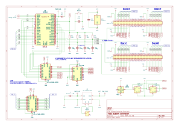
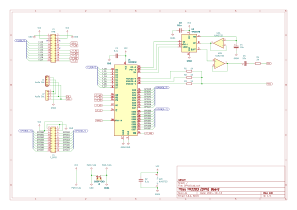
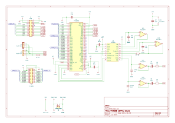
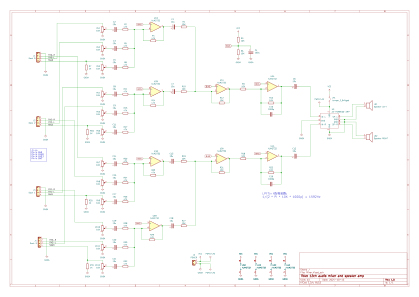
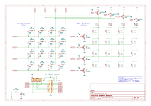

# ハードウェア

## 構造

モジュール構造のハードウェアとなっている。
コントローラモジュールには4本のDockがあり、FM音源モジュールを接続する。YM2203とYM2608が混在可能。  
FM音源モジュールのアナログ出力は、ミキサー・アンプモジュールを接続する。  
コントロールパネルモジュールはFM音源モジュールのI/Oポートに接続する。

### コントローラモジュール

電源容量や実装の制約上、Dock数は4つまでとしているが、回路的には7台までのFM音源モジュールを制御可能。PCBは製作していない。

システムコントローラーはRaspberryPi Pico2を使用しているが、パフォーマンスは若干落ちるがPicoも使用可能。

FM音源モジュールの制御に以下の19本のGPIOを使用している。

- /CS生成用3bit
- /RD, /WR
- A0, A1
- D0 - D8
- /IRQ (4bit)

FM音源LSIは5V系なので、Raspberry Pi Picoとの接続には[AE-LLCNV8-DIP20](https://akizukidenshi.com/catalog/g/g117062/)などで3.3V/5Vレベル変換が必要である。

アナログ回路の低ノイズ化を考慮して、秋月電子の超ローノイズ可変電圧キット[AE-TPS7A4700](https://akizukidenshi.com/catalog/g/g106194/)を5V出力で使用している。
消費電流は800mA程度を見込む必要があり、入出力電圧差は1V程度としなければならない。
6V/1.8Aの[AD-A60P180](https://akizukidenshi.com/catalog/g/g111997/)を推奨ACアダプタとする。

### FM音源モジュール：YM2203(OPN)

クロックは4MHz。FM音源1ch(モノラル), SSG音源1ch出力。I/O PORT用端子あり。
PCB製作済み。

### FM音源モジュール：YM2806(OPNA)

クロックは8MHz。FM音源2ch(ステレオ), SSG音源1ch出力。I/O PORT用端子あり。ADPCMには非対応。
PCB製作済み。

### ミキサー・アンプモジュール

4つ分のFM音源モジュール出力をオペアンプで加算し、ローパスフィルターを通した後、秋月電子のスピーカーアンプキット[AE-PAM8403-AMP](https://akizukidenshi.com/catalog/g/g115698/)に入力している。PCBは製作していない。

電源は[AE-TPS7A4700](https://akizukidenshi.com/catalog/g/g106194/)の5V出力に接続する。FM音源モジュール1つにつきFM音源出力2ch(YM2203は1ch)とSSG音源1chの合計3chの出力があるので、テストプログラムで440Hzの音を出しながら、3個のボリュームでそれぞれのレベルを調整する。

### コントロールパネルモジュール

FM音源モジュールのPORT-A/Bに接続することで、MIDIチャンネルのON/OFF、MIDIリセットができるようになる。LEDはMIDIチャンネルごとのKeyOn状態、またはON/OFF状態を表示する。

ポートのビット数や入出力方向に制限があるため、マトリックス回路構成にしている。PCB製作済み。

(YM2608(OPNA)モジュール基板のPort-A/Bまわりの回路図にバグがある。MSB/LSBが反転しているため、config.hでワークアラウンドを有効にする必要がある。)

## KiCad

回路図およびPCBの作成には[KiCad8](https://www.kicad.org/)を使用した。
