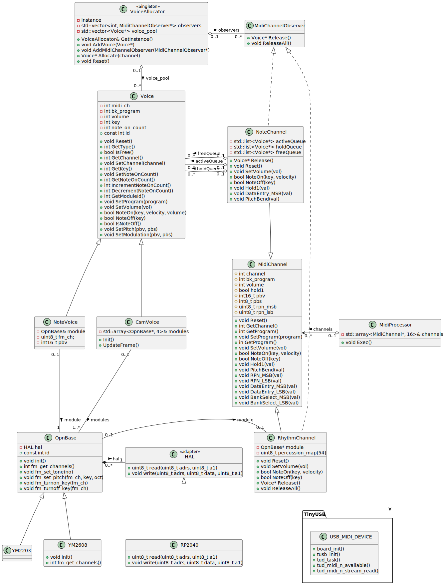
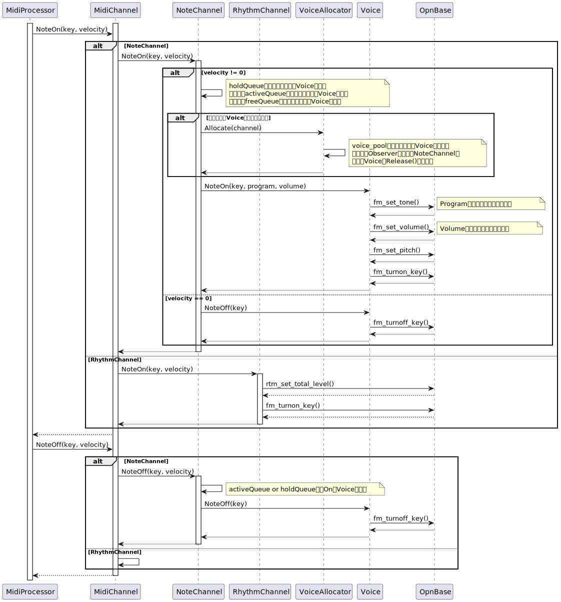

# ソフトウェア設計仕様

## クラス

### HAL

ハードウェア抽象化のためのインターフェースである。
HALを継承したクラスで、FM音源レジスタ操作を行う`read()`,`write()`を実装する。
アトミックな動作を保証しなければならない。

#### RP2040

HALを継承したRapberryPi Pico用の実装クラス。
GPIOでA0,A1,/RD,/WR,/CSを操作し、FM音源を制御する。
一連のバスシーケンスの前後で割り込みの禁止・許可を行い、同一コア内でのI/Oアクセスのアトミック性を保証している。
マルチコア間でのアトミック性は保証されないことに注意。

### MidiChannel

MIDIチャンネルのインターフェースである。
共通のチャンネル操作のインターフェースを提供する。

#### NoteChannel

MIDIチャンネル1-9,11-16用を管理する実装クラス。MidiChannelを継承する。

Voice管理用のキューを持ち、NoteVoiceとCsmVoiceの制御を行う。

#### RhythmChannel

MIDIチャンネル10で使用するリズム用チャンネルの実装クラス。MidiChannelを継承する。

MidiProcessorからは、MidiChannelのインターフェースで呼び出される。パーカッションマップを持っており、指定されたProgramはこのマップから選択する。

- 現在の実装
  - YM2608のリズム音源を使用しているが、6種類しかないので、パーカッションマップにすべて対応させることができていない。非対応のProgramを指定された場合は発音しない。
  - NoteOn/OffはMidiChannelのインターフェース経由で呼ばれ、YM2608のリズム音源で発音する。
  - FM音源Voiceを使用しないので、Voiceインスタンスはこのチャンネルには割り当てていない。

### クラス図



## MIDIチャンネルへのVoiceの動的割り当て

本機は16チャンネルMIDIをサポートする、マルチティンバー、ポリフォニック仕様のMIDI音源である。
例えばYM2608を4台接続した場合、1つのYM2608につき6個の独立したFM音源Voiceを持つので、24マルチティンバー/24ポリフォニックとなる。
使用するMIDIチャンネル数、音色数、同時発音数などは楽曲により異なるため、破綻なく演奏を行うためには有限個のFM音源Voiceを動的に管理する必要がある。

MIDIチャンネルへのVoiceの割り当てと再利用は、VoiceAllocatorとNoteChannelが協調して行う。
Voiceの割り当てはNoteChannelが主導する。音色の変更はコストが大きいため、同一チャンネル内で音色変更なしに再利用するのがパフォーマンス的に有利だからである。
チャンネル内で割り当てができない場合は、VoiceAllocatorが処理を引き継ぐ。VoiceAllocatorは、チャンネル間の調停を行い未使用のVoiceを探し出す。

具体的な動作は以下の通り。

はじめにMIDIチャンネルにNoteOn要求が来たタイミングで、Voiceの割り付けが行われる。

1. 当該MIDIチャンネル内で未使用なVoiceを探す。
2. あれば再利用する。
3. なければVoiceAllocatorに新規Voiceを要求する。
4. 新規Voiceが獲得できたら利用し、当該チャンネルの管理キューに加える。
5. 獲得できなければ、NoteOnは失敗。

これを全MIDIチャンネルで行うと、Voiceの不足や未使用Voiceの偏りが発生する。そこでVoiceAllocatorがMIDIチャンネルを横断して未使用Voiceの検索を行う。

1. MIDIチャンネルからVoice要求があったら、Voice Poolから未使用のVoiceを探す。
2. あればそれを要求元に与える。
3. なければ、未使用Voiceの解放をMIDIチャンネルに要求する。(注)
4. Voiceが回収できたら、要求元に与える。
5. Voiceが一つも回収できない場合はnullptrを返す。Voiceが枯渇したのでNoteOnは失敗。

(注):MIDI優先度の低いチャンネル15から0に向かって順番に要求していく。ただしVoiceの要求元チャンネルは除く。

上記に加え、同一MIDIチャンネル内ではなるべくFM音源モジュールになるよう、Voiceの検索を行っている。

- NoteChannelでは、直前に使用したVoiceと同じモジュールIDのVoiceがfreeQueueにあれば、それを優先的に使う。
- VoiceAllocatorに割り当て要求する場合はモジュールIDを渡す。モジュールIDは、activeQueueまたはholdQueueで直近使用したVoiceのものを使用する。
- VoiceAllocatorは割り当て候補の中から、モジュールIDの一致するものを優先して割り付ける。

### シーケンス図



### NoteChannelでのVoice管理


## Note ON/OFF管理

Voiceの状態管理とダンパー処理は[こちらの記事](https://pcm1723.hateblo.jp/archive/category/%E3%83%9C%E3%82%A4%E3%82%B9%E3%83%BB%E3%82%A2%E3%82%B5%E3%82%A4%E3%83%8A)が非常に参考になったので、アルゴリズムを流用させていただいた。

NoteChannelはVoiceの状態管理に以下のキューを持つ。

- activeQueue : NoteOn状態のVoice
- holdQueue : NoteOffが保留されているVoice(ダンパー処理)
- freeQueue : 未使用のVoice

パラメータ(Program, Volume, Note番号)を更新とともに発音し、activeQueueに追加する。パラメータは、以前のVoice設定から変化があったものだけを更新する。

- Velocity=0でのNoteOnは、NoteOffとして扱う
- NoteOn時のVelocityによる音量変化 (未実装)
- 同一Note番号に対し、NoteOffされることなくNoteOnが複数回行われた場合(NoteOnのオーバラップ)
  - 現在のVoiceを使い回す。別Voiceを割り当てるほうが簡単だが、同時使用できるVoiceが減ってしまうため。
  - NoteOff要求で単純に消音すると、オーバラップ分がキャンセルされてしまう。そこでリファレンスカウンタ(note_on_counter)を用意し、NoteOnごとにインクリメント、NoteOffでデクリメントし、0になるまでは消音しないようにする。
- ダンパーペダルの処理 (CC #64 Hold1)
  - ダンパーON中は、NoteOffを保留する必要がある。NoteOnが来たらそのVOiceはholdQueueに追加する。
  - ダンパーOFFになったら、holdQueueおよびactiveQueueのVoiceはNoteOffし、VoiceをfreeQueueに移動させる。

## アナログ出力先(L/R)とPan設定

- YM2608はステレオ出力(L/R)を選択できる。
  - デフォルトで偶数MIDIチャンネルはLに、奇数MIDIチャンネルはRに出力する。(NoteChannelのコンストラクタで設定。) CC#10 Panで設定できるが、0-127をL/LR/Rの3分割しかできない。
  - MIDIチャンネル10(リズムチャネル)で使用しているYM2608のリズム音源は、L/R両方に出力する。RhythmChannelのコンストラクタで設定。
- YM2203はモノラル出力なので、以下の仕様に従う。
  - 偶数Dockに接続した場合はLに、奇数Dockに接続した場合はRに出力される。
  - CC#10の設定は反映されない。

## 音量制御

CC#7, CC#11でVoiceの音量制御を行うことができる。

### FM音源の音量制御

FM音源Voiceは音量制御が厄介である。

OPNでは4つのオペレータにキャリアとモジュレータという役割を持たせ、その組み合わせ(アルゴリズム)で1つの音色を表現する。しかし出来上がった音全体に対して音量を指定することができない。全体の音量はキャリアの振幅が支配する性質があるため、下表のようにアルゴリズムに応じて、キャリアオペレータのTotal Levelを変化させることで、音量を制御を実現している。それぞれのTotal Levelは音色を決定するパラメータの一つなので、キャリアオペレータが複数ある場合は、設定比率を考慮しないと音色が変化してしまう。しかし聴感上の違いがわからなかったので、同一値を設定している。

|アルゴリズム|キャリアオペレータ|
|:--------:|-----:|
|     0    |4|
|     1    |4|
|     2    |4|
|     3    |4|
|     4    |2,4|
|     5    |2,3,4|
|     6    |2,3,4|
|     7    |1,2,3,4|

### Rhythm音源

MIDIチャンネル10ではRhythmChannelクラスで実装されており、YM2608(OPNA)の内蔵する6種類のRhythm音源を使用している。
RTL(Rhythm Total Level)とIL(Instrument Total Level)の2種類の音量体系を持つ。
RTLはリズム全体の音量で、63で0dB(最大音量)、0で-47.5dB(ミュート)となる。
ITLは六種それぞれの楽器ごとの音量で、31で0dB(最大音量)、0で-23.25dB(ミュート)である。

### MIDIメッセージとの対応

1. CC #7 : Volume  
  指定チャンネルの音量を変更する。発音中のVoiceにもリアルタイムに適用される。
2. CC #11 : Expression  
  現在の実装はCC#7と同じ。本来はCC#7で設定された音量を基準として相対的な音量変化を加える。
3. NoteOn時のVelocity  
  考慮していない。

## ピッチベンド

- {pbv,pbs}はMidiChannelのインスタンス内で保持する。
- pbsは、CC#100, #101, #6のシーケンスにより、RPNでセットする。
- MIDI PitchBendメッセージ(CC#6)受信のたびに、activeQueueのVoiceに対し{pbv,pbs}をリアルタイムに適用する。処理の負荷と適用効果を考慮し、holdQueueのメッセージには適用していない。
- Note ONでは指定されたNote番号を基準に、Voiceの所属するMidiChannelの現在の{pbv,pbs}に応じたF-NumberとBlock Numberを計算する。


|  値    |                          | 範囲  |
|:------:|-------------------------|:-----:|
| $pbv$  | ピッチベンド値             |-8192 - 8191 |
| $pbs$  | ピッチベンドセンシティビィティ| 0-127 |
|  $x$   | 現在のMIDI Note番号        | 0-127 |
|  $p$   | pbv近傍のMIDI Note番号     | 0-127 |
| $N(p)$ | pbv近傍のF-Number         ||
| $F$    | 求めるF-Number            ||
| $B(p)$ | 求めるBlock Number        |0-7|

ピッチを変化させるには、pbvに応じたF-NumberとBlock Numberを求め、FM音源チャンネルにセットしなければならない。
F-Numberは1オクターブ分のテーブルを持っているので、pbvの前後のNote番号から比例配分で求める。

$$
\begin{equation}
\begin{split}
B(p) &= \lceil \frac{p}{12} \rceil - 1 \\
p &= \lceil \frac{pbv \times pbs}{8191} \rceil + x; \\
\end{split}
\end{equation}
$$

$$
\begin{equation}
\begin{split}
F &= (N(p+1) - N(p)) \times \frac{a}{b} \\
b &= \frac{8191}{pbs} \\
a &= pbv \mod b \\
\end{split}
\end{equation}
$$

## モジュレーションとビブラート

YM2203を使用する場合は設定が無視される。
YM2608を使用する場合は、LFOを使用したモジュレーションおよびビブラートをサポートしている。両者は実質同一の処理である。

### モジュレーション

CC#1で指定された値を、LFOのPMS(Phase Modulation Sesitivity)に反映させる。
F-Numner/Blockの周波数変調がかかり、音色が現在のLFO周波数で変化する。デフォルトのLFO周波数は、3.98Hzである。
指定MIDIチャンネルにリアルタイムに反映される。
CC#1ではLFO周波数は指定できないが、NRPNで指定されたものが使用される。これは、FM音源モジュールにLFOが1台しか存在しないためである。

### ビブラート

現在のLFO周波数は、CC#99/#98/#6のシーケンスで、LFO周波数と深さを設定できる。深さに関してはCC#1のモジュレーションと同等である。

## ランニングステータス

最初のステータスバイトだけ送り、続くメッセージのステータスバイトを省略してデータバイトだけを連続して送ることができる。
これをランニング・ステータスといい、ノートオンなどの頻出メッセージを効率よく送信できる。
MidiProcessorクラスでは、MIDIメッセージ受信時にランニングステータスを検出したら、記憶しておいた直近のステータスバイトで補完している。

## CSM Voice

FM音源CH3のCSMモードを使った音声合成に対応している。
通常のFM音源チャンネルとはしくみが大きく異なるため、CsmVoiceクラスの中で発音制御を行っている。Voiceクラスのインターフェースを継承しているのでNoteVoiceと同じように扱うことができる。
ただし、以下の機能は実装していない。

- ピッチベンド  
  Timer Aを使ってピッチを連続的に変化させるのが困難。
- モジュレーション  
  LFOがチャンネル3だけにかけることができない。CSM次数が4以上の場合、複数のFM音源モジュールを使うことになるので、音楽用のVoiceに与える影響が大きい。

CSM Voiceを使用するには、CC#0/#32でバンクを切り替える。

## デバッグ機能

MIDIチャンネルやVoiceの状態を確認できるよう、コア1側にデバッガを実装している。
ただしコア1側でFM音源モジュールの制御は行なっていない。複数コアからのアトミックな操作が保証できないからである。
コア1側はコンソールベースの対話機能を、実際のコマンドはFIFO経由でコア0にを送り、MIDIループの中で実行する。

## USB MIDIインターフェース

USB MIDIデバイスの実装には、[TinyUSB](https://github.com/hathach/tinyusb)を利用している。

## MidiPanel

FM音源モジュールのPORT-A/Bに接続する拡張基板で、物理的なMIDI 16チャンネルのON/OFFとMIDIリセットをサポートする。
8bitの入出力ポート2つで、16チャンネル分のトグルスイッチとLEDを制御する必要があるため、ハードウェア的には4x4のマトリックス回路となっている。
MidiPanel::Update()を呼び出すことで1列分(4チャンネル)の状態を更新する。従って16チャンネル分の情報が更新には4回の呼び出しが必要となり時差が発生するが、LEDはダイナミック点灯になるため消費電力が抑えられる。MidiPanel::Update()は、MIDIループ内で毎回呼び出すため、体感的にはリアルタイムに更新される。

### OPNAボードのバグ

基板の設計ミスで、PORT-A/Bともに、8bit全信号のMSB/LSBが逆転している。
OPNAボードを使用する場合は、config.hの以下のマクロを有効にする必要がある。

```C
#define ENABLE_CONNECTOR_WIRING_BUG_WORKAROUND 1
```

## その他

- [FM音源LSIのTips](./tips.md)
